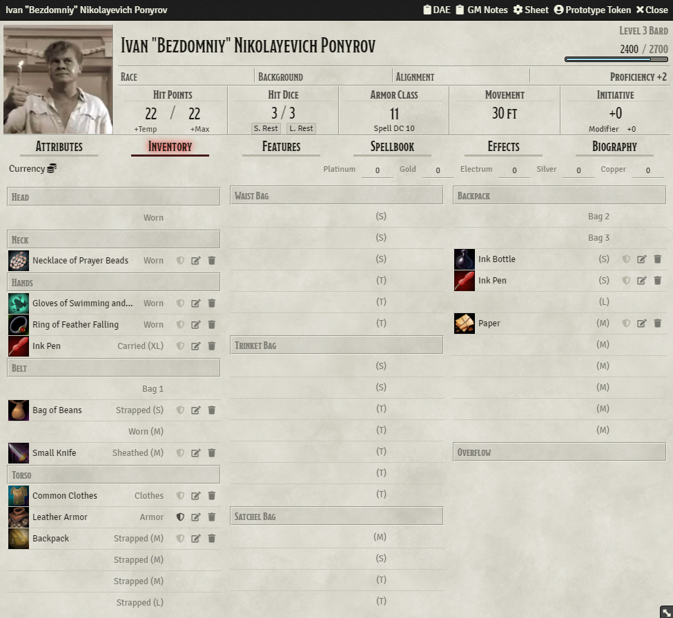

# Slotted Inventory (5e)

A 5e slotted inventory sheet for FoundryVTT commissioned by 12TripleAce12#2200.

This module modifies the default DND5e character sheet to phase out encumbrance and instead
utilize a slot-based system.

### Installation 

To install a module, follow these instructions:

1. Review the [FoundryVTT Wiki for installing modules](https://foundryvtt.wiki/en/basics/Modules)
2. Provide the following manifest url: https://github.com/Yidna/fvtt-slotted-inventory/raw/master/module.json

### Features
- items can still be rolled on, viewed, edited, and deleted
- drag and drop of items between slots
- inventory separated by categories with slots such as
  - head
  - neck
  - hands
  - belt
  - torso
  - waist
  - backpack
  - trinket bag
  - satchel bag
  - overflow
- annotations on slots denoting intended item types and sizes
- an automatically resizing overflow section

### Compatibility Notes
- the inventory overflow section will not automatically shrink when an item is deleted if
  MidiQOL's delete confirmation dialog is enabled
- does not work with the Tidy5e sheet

### Feedback

If you have any suggestions or feedback, feel free to create an [Issue on Github](https://github.com/Yidna/fvtt-simple-chat-damage-buttons/issues)

